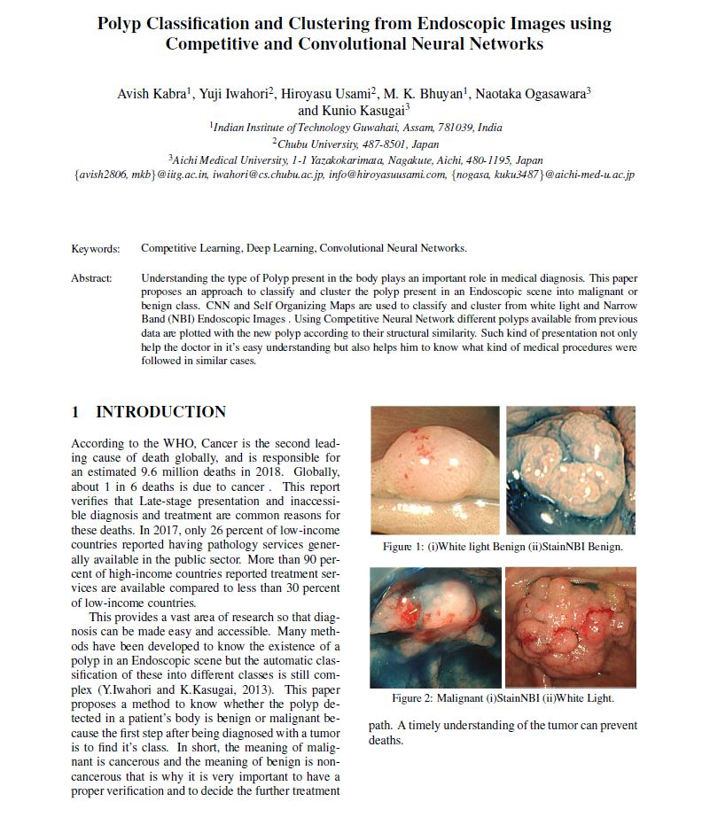
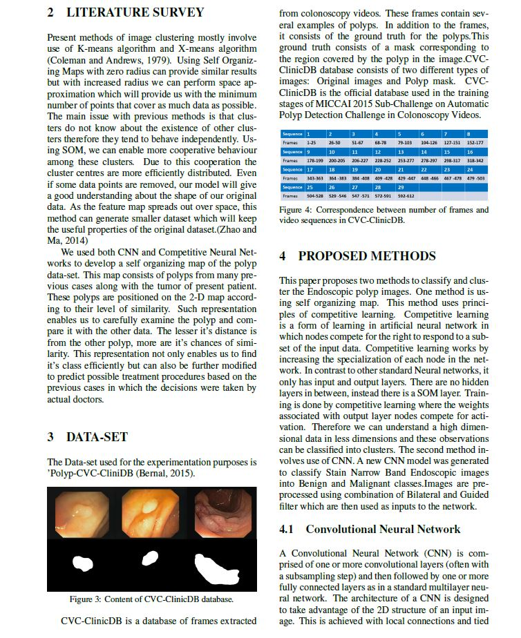
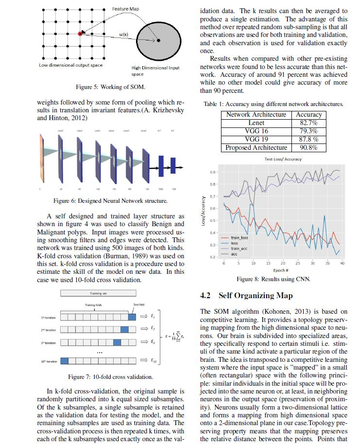
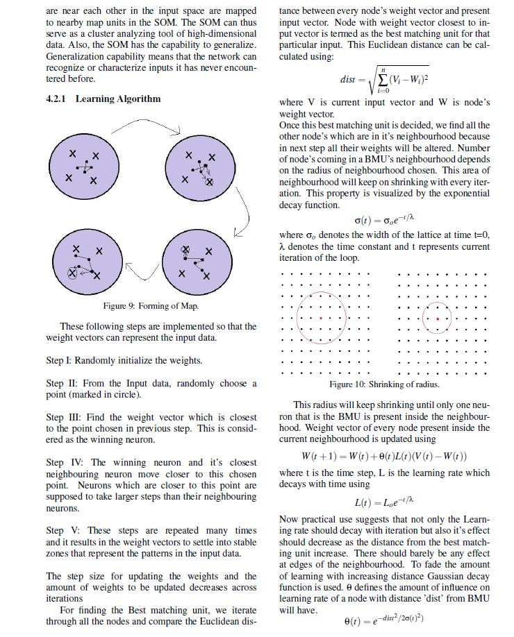
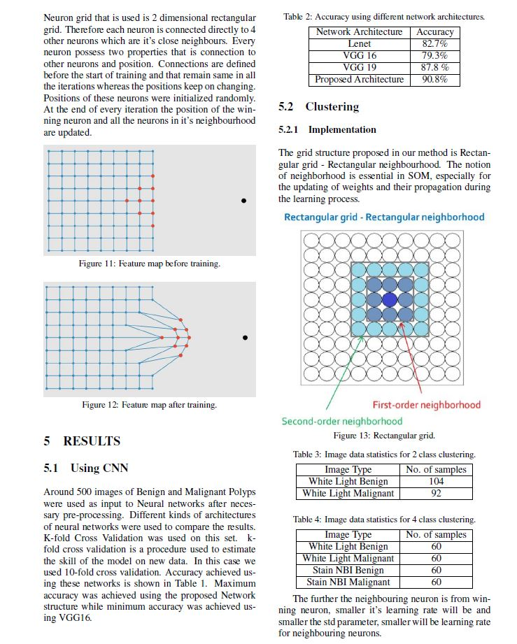
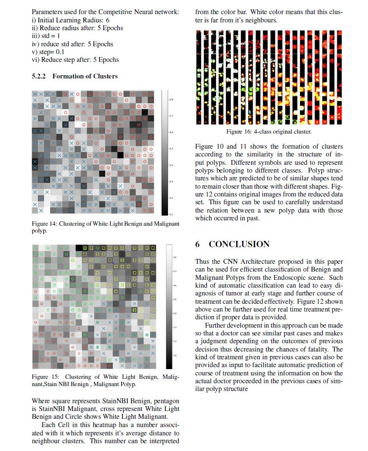

Run the "final_network.py" file which is written in python3
final_network.py file requires 2 arguements both of which are required and not optional.
first arguement should be path to input database.
second arguement should be path to output model.

example: "python3 final_network.py --dataset images --model mynet.model"
then run tne file.
Output plot will be saved in the same directory as "plot.png"

Find full text of published paper at:
https://www.researchgate.net/publication/331775734_Polyp_Classification_and_Clustering_from_Endoscopic_Images_using_Competitive_and_Convolutional_Neural_Networks

